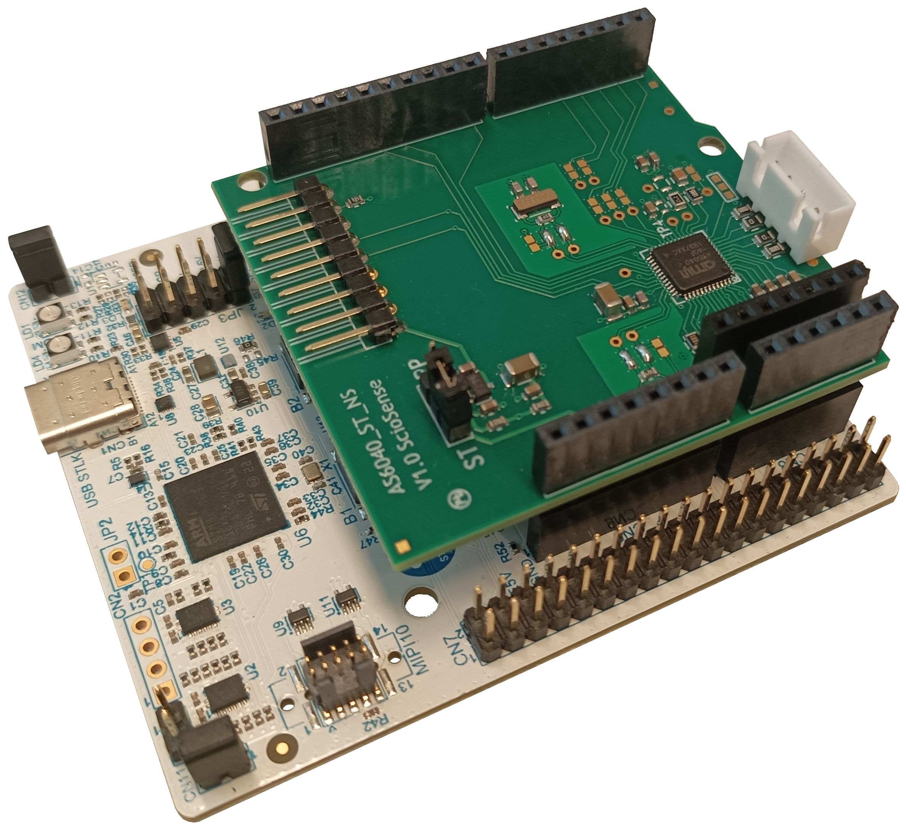
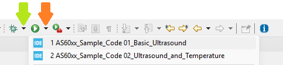
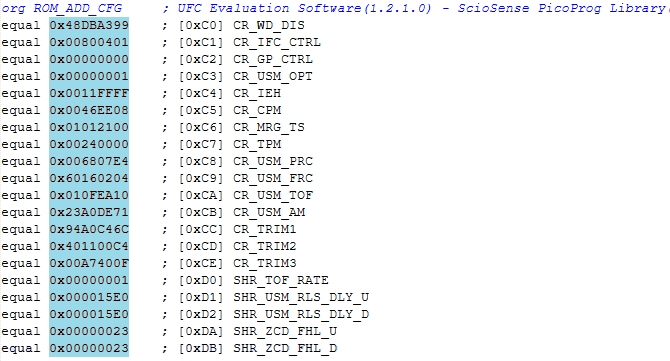

# STM32 project examples for ScioSense AS6031, AS6031F1 and AS6040 ultrasound sensors
The AS60xx sensor family from [ScioSense](https://www.sciosense.com/) offers ultrasonic flow converters for the next generation of ultrasonic water, gas, and heat meters. The sensors come in the size QFN48 package with digital SPI interface. This enables new use cases in single-chip solution provided ready flow information, system design compatible with mechanical meters, high flexibility in choice for external μC handling communication and further data management, precision down to low flow rates and leakage detection.

## Links
* Latest datasheet and application notes are on [ScioSense site](https://www.sciosense.com/ultrasonic-flow-converters/)
* Buy the AS6031 on [Mouser](https://www2.mouser.com/ProductDetail/ScioSense/AS6031-BQFM?qs=DPoM0jnrROWSi1b8OH79RQ%3D%3D) or [Digikey](https://www.digikey.com/en/products/detail/sciosense/as6031-bqfm/17282629)
* Buy the AS6031F1 on [Mouser](https://www.mouser.com/ProductDetail/ScioSense/AS6031F1-BQFM?qs=Rp5uXu7WBW%2FW%2FA74%2Fu76VQ%3D%3D) or [Digikey](https://www.digikey.com/en/products/detail/sciosense/AS6031F1-BQFM/17282627)
* Buy the AS6040 on [Mouser](https://www2.mouser.com/ProductDetail/ScioSense/AS6040-BQFM?qs=DPoM0jnrROWLsLNoAXnDuQ%3D%3D) or [Digikey](https://www.digikey.com/en/products/detail/sciosense/AS6040-BQFM/17282632)
* Buy the AS6031 ST evaluation kit on [Mouser](https://www2.mouser.com/ProductDetail/ScioSense/AS6031_ST_NS-V1.0?qs=DRkmTr78QAQPNfU21SQXMg%3D%3D)
* Buy the AS6040 ST evaluation kit on [Mouser](https:///www2.mouser.com/ProductDetail/ScioSense/AS6040_ST_NS-V1.0?qs=DRkmTr78QATH6T6ez%2F%252BIaw%3D%3D)
* [Further information about the AS6031](https://www.sciosense.com/as6031f1-ultrasonic-flow-converter/) 
* [Further information about the AS6040](https://www.sciosense.com/as6040-ultrasonic-flow-converter/) 

## Prerequisites
It is assumed that
 - The STM32CubeIDE has been installed.
   If not, refer to "Install the STM32CubeIDE" on the
   [ST site](https://www.st.com/en/development-tools/stm32cubeide.html#overview).
 - The STM32CubeMX has been installed.
   If not, refer to "Install the STM32CubeMX" on the
   [ST site](https://www.st.com/en/development-tools/stm32cubemx.html).
 - The STM32CubeProgrammer could been installed, optionally.
   If not, refer to "Install the STM32CubeProgrammer" on the
   [ST site](https://www.st.com/en/development-tools/stm32cubeprog.html).
 - The STM32CubeMonitor could been installed, optionally.
   If not, refer to "Install the STM32CubeMonitor" on the
   [ST site](https://www.st.com/en/development-tools/stm32cubemonitor.html).
   
You might need to add your board to the STM32CubeIDE. This library was tested with the [STM32 Nucleo-64 development board with STM32U385RG MCU](https://www.st.com/en/evaluation-tools/nucleo-u385rg-q.html). The library uses function definitions that are for the U385RG core, and the pin function definitions are configured for the nucleo board in combination with the ScioSense shield.
For the installation of the STM32U385RG in the STM32CubeIDE, see [STM32U385RG Installation](https://www.st.com/en/development-tools/stm32cubemx.html#documentation)

## Installation

### Manual installation
- Download the code from this repository via "Download ZIP".
- In STM32CubeIDE, select Import > General > Existing Projects into Workspace... and browse to the just unpacked ZIP file.
- When the IDE is ready this README.md should be located in your workspace.

## Wiring

### General
THE UFC ST shield is made to fit directly on the Arduino connectors of the Nucleo board. Please refer to the [UFC ST Nucleo Shield application note](https://www.sciosense.com/wp-content/uploads/2023/12/UFC-ST-Nucleo-Shields-Expansion-Boards-User-Guide.pdf) for information about how to connect an ultrasound transducer and temperature sensors.

:warning: Please check that the jumper is on the ST position.



## Running the code

### Selecting an example
The project has two examples:
- 01_AS60xx_Example_Basic_Ultrasound
  - Reports average Time of Flight (ToF), received amplitude, and pulse width ratio 
- 02_AS60xx_Example_Ultrasound_and_Temperature
  - Reports average ToF, 2-wire temperature measurements, and sensor internal temperature. Also indicates if some specific errors were detected
- 03_AS6031F1
  - Measures the calculated accumulated flow, instant flow, and temperature from the AS6031F1. No configuration is written into the device

There is one Build configuration for each example.

The main.c file (in _/Core/Src/_) imports the AS60xx_Example_Setup() and AS60xx_Example_Loop() functions from the specified example on the Build configuration. The examples are in _/Core/Src/ScioSense_, while the AS60xx library is in  _/Core/Src/ScioSense/src_.

The Build configuration to use for running or debugging the code on the STM32 nucleo can be selected by pressing the selector arrow next to the debug or run button:



## Selecting a sensor configuration
Two different ways of selecting the AS60xx sensor configurations are showcased in the examples given:
 - Modifying each configuration parameter individually, as showcased in the *01_AS60xx_Example_Basic_Ultrasound* example, on function _SetConfigurationAS60XX_Demo_1MHz_water_meter_FHL_
 - Inputing the configuration register contents as an array, as showcased in the *02_AS60xx_Example_Ultrasound_and_Temperature*

### Importing configuration
The easiest way to create a new configuration is to use the ScioSense dashboard [UfcEvaluationSoftware](https://downloads.sciosense.com/as6031/). Once the desired configuration has been prepared, it can be exported from the Dashboard main screen by clicking _Export Config as Hex...


The generated configuration file contains the content of the configuration registers to be copied into the AS60xx. 



These values have to be copied in the same order into an array, and feed that array into the function _setConfigurationRegisters_

## Example output
### *01_AS60xx_Example_Basic_Ultrasound*
This example measures the average ToF both upstream and downstream and takes the difference. The received singal amplitude and the pulse width ratio are also displayed for upstream and downstream.

During the initialization the high speed clock source and suply voltage are measured and reported.

The flow was started some seconds after initialization to demonstrate the output change.
```
Starting AS60xx 01_AS60xx_Example_Basic_Ultrasound demo on STM32...
AS60xx initialized properly
High Speed Clock Frequency: 3.993 MHz
Supply Voltage: 3275 mV
Configuration properly written
Measurements started
Timestamp[hh:mm:ss]:0:00:02 AvgTofSumUp[ns]:68318.17    AvgTofSumDn[ns]:68318.52    TofDiff[ns]:-0.34   AmpUp[mV]:447   AmpDn[mV]:449   PWRUp[]:0.805   PWRDn[]:0.805
Timestamp[hh:mm:ss]:0:00:02 AvgTofSumUp[ns]:68317.94    AvgTofSumDn[ns]:68318.04    TofDiff[ns]:-0.10   AmpUp[mV]:446   AmpDn[mV]:447   PWRUp[]:0.805   PWRDn[]:0.805
Timestamp[hh:mm:ss]:0:00:03 AvgTofSumUp[ns]:68317.55    AvgTofSumDn[ns]:68317.93    TofDiff[ns]:-0.38   AmpUp[mV]:443   AmpDn[mV]:446   PWRUp[]:0.805   PWRDn[]:0.805
Timestamp[hh:mm:ss]:0:00:03 AvgTofSumUp[ns]:68317.38    AvgTofSumDn[ns]:68317.42    TofDiff[ns]:-0.05   AmpUp[mV]:443   AmpDn[mV]:445   PWRUp[]:0.812   PWRDn[]:0.805
Timestamp[hh:mm:ss]:0:00:03 AvgTofSumUp[ns]:68317.03    AvgTofSumDn[ns]:68317.27    TofDiff[ns]:-0.24   AmpUp[mV]:440   AmpDn[mV]:443   PWRUp[]:0.805   PWRDn[]:0.797
Timestamp[hh:mm:ss]:0:00:03 AvgTofSumUp[ns]:68317.81    AvgTofSumDn[ns]:68315.23    TofDiff[ns]:2.59    AmpUp[mV]:441   AmpDn[mV]:441   PWRUp[]:0.805   PWRDn[]:0.797
Timestamp[hh:mm:ss]:0:00:04 AvgTofSumUp[ns]:68322.56    AvgTofSumDn[ns]:68308.63    TofDiff[ns]:13.93   AmpUp[mV]:439   AmpDn[mV]:438   PWRUp[]:0.805   PWRDn[]:0.797
Timestamp[hh:mm:ss]:0:00:04 AvgTofSumUp[ns]:68322.33    AvgTofSumDn[ns]:68297.59    TofDiff[ns]:24.74   AmpUp[mV]:437   AmpDn[mV]:435   PWRUp[]:0.797   PWRDn[]:0.797
Timestamp[hh:mm:ss]:0:00:04 AvgTofSumUp[ns]:68320.76    AvgTofSumDn[ns]:68290.58    TofDiff[ns]:30.18   AmpUp[mV]:428   AmpDn[mV]:426   PWRUp[]:0.797   PWRDn[]:0.789
Timestamp[hh:mm:ss]:0:00:04 AvgTofSumUp[ns]:68300.77    AvgTofSumDn[ns]:68266.87    TofDiff[ns]:33.90   AmpUp[mV]:401   AmpDn[mV]:403   PWRUp[]:0.766   PWRDn[]:0.773
Timestamp[hh:mm:ss]:0:00:05 AvgTofSumUp[ns]:68319.55    AvgTofSumDn[ns]:68283.28    TofDiff[ns]:36.27   AmpUp[mV]:422   AmpDn[mV]:417   PWRUp[]:0.797   PWRDn[]:0.781
Timestamp[hh:mm:ss]:0:00:05 AvgTofSumUp[ns]:68327.09    AvgTofSumDn[ns]:68288.99    TofDiff[ns]:38.09   AmpUp[mV]:427   AmpDn[mV]:425   PWRUp[]:0.797   PWRDn[]:0.789
Timestamp[hh:mm:ss]:0:00:05 AvgTofSumUp[ns]:68324.25    AvgTofSumDn[ns]:68282.70    TofDiff[ns]:41.55   AmpUp[mV]:410   AmpDn[mV]:418   PWRUp[]:0.789   PWRDn[]:0.781
Timestamp[hh:mm:ss]:0:00:05 AvgTofSumUp[ns]:68322.58    AvgTofSumDn[ns]:68275.23    TofDiff[ns]:47.34   AmpUp[mV]:416   AmpDn[mV]:401   PWRUp[]:0.789   PWRDn[]:0.773
Timestamp[hh:mm:ss]:0:00:06 AvgTofSumUp[ns]:68329.22    AvgTofSumDn[ns]:68286.81    TofDiff[ns]:42.41   AmpUp[mV]:418   AmpDn[mV]:415   PWRUp[]:0.789   PWRDn[]:0.781
Timestamp[hh:mm:ss]:0:00:06 AvgTofSumUp[ns]:68326.70    AvgTofSumDn[ns]:68281.97    TofDiff[ns]:44.73   AmpUp[mV]:417   AmpDn[mV]:413   PWRUp[]:0.789   PWRDn[]:0.781
```

### *02_AS60xx_Example_Ultrasound_and_Temperature*
This example measures the average ToF both upstream and downstream and takes the difference. The values of the hot and cold RTD sensors are measured in two-wire mode and reported together with the chip internal temperature. If the temperature sensor is an open circuit, shortcircuit, or if the charge pump report an error, it will be printed.

During the initialization the high speed clock source and suply voltage are measured and reported.

The flow was started some seconds after initialization to demonstrate the output change.
```
Starting AS60xx 02_AS60xx_Example_Ultrasound_and_Temperature demo on STM32...
AS60xx initialized properly
High Speed Clock Frequency: 3.993 MHz
Supply Voltage: 3275 mV
Configuration properly written
Measurements started
Timestamp[hh:mm:ss]:0:00:04 AvgTofSumUp[ns]:68313.27    AvgTofSumDn[ns]:68313.35    TofDiff[ns]:-0.09   TempH[degC]:52.770  TempC[degC]:22.204  TempInt[degC]:18.123
Timestamp[hh:mm:ss]:0:00:04 AvgTofSumUp[ns]:68313.17    AvgTofSumDn[ns]:68313.20    TofDiff[ns]:-0.03   TempH[degC]:52.770  TempC[degC]:22.204  TempInt[degC]:18.123
Timestamp[hh:mm:ss]:0:00:04 AvgTofSumUp[ns]:68313.26    AvgTofSumDn[ns]:68313.34    TofDiff[ns]:-0.09   TempH[degC]:52.770  TempC[degC]:22.204  TempInt[degC]:18.123
Timestamp[hh:mm:ss]:0:00:05 AvgTofSumUp[ns]:68313.40    AvgTofSumDn[ns]:68313.30    TofDiff[ns]:0.09    TempH[degC]:52.770  TempC[degC]:22.204  TempInt[degC]:18.123
Timestamp[hh:mm:ss]:0:00:05 AvgTofSumUp[ns]:68313.48    AvgTofSumDn[ns]:68313.47    TofDiff[ns]:0.02    TempH[degC]:52.770  TempC[degC]:22.204  TempInt[degC]:18.123
Timestamp[hh:mm:ss]:0:00:05 AvgTofSumUp[ns]:68313.65    AvgTofSumDn[ns]:68313.52    TofDiff[ns]:0.12    TempH[degC]:52.770  TempC[degC]:22.204  TempInt[degC]:18.123
Timestamp[hh:mm:ss]:0:00:05 AvgTofSumUp[ns]:68313.79    AvgTofSumDn[ns]:68313.79    TofDiff[ns]:0.00    TempH[degC]:52.770  TempC[degC]:22.204  TempInt[degC]:18.123
Timestamp[hh:mm:ss]:0:00:06 AvgTofSumUp[ns]:68314.20    AvgTofSumDn[ns]:68313.76    TofDiff[ns]:0.45    TempH[degC]:52.770  TempC[degC]:22.204  TempInt[degC]:18.123
Timestamp[hh:mm:ss]:0:00:06 AvgTofSumUp[ns]:68315.53    AvgTofSumDn[ns]:68308.46    TofDiff[ns]:7.07    TempH[degC]:52.770  TempC[degC]:22.204  TempInt[degC]:18.123
Timestamp[hh:mm:ss]:0:00:06 AvgTofSumUp[ns]:68315.53    AvgTofSumDn[ns]:68308.46    TofDiff[ns]:7.07    TempH[degC]:52.776  TempC[degC]:22.208  TempInt[degC]:18.122
Timestamp[hh:mm:ss]:0:00:06 AvgTofSumUp[ns]:68317.32    AvgTofSumDn[ns]:68296.91    TofDiff[ns]:20.41   TempH[degC]:52.776  TempC[degC]:22.208  TempInt[degC]:18.122
Timestamp[hh:mm:ss]:0:00:06 AvgTofSumUp[ns]:68309.64    AvgTofSumDn[ns]:68279.23    TofDiff[ns]:30.41   TempH[degC]:52.776  TempC[degC]:22.208  TempInt[degC]:18.122
Timestamp[hh:mm:ss]:0:00:07 AvgTofSumUp[ns]:68323.41    AvgTofSumDn[ns]:68290.08    TofDiff[ns]:33.34   TempH[degC]:52.776  TempC[degC]:22.208  TempInt[degC]:18.122
Timestamp[hh:mm:ss]:0:00:07 AvgTofSumUp[ns]:68322.46    AvgTofSumDn[ns]:68291.09    TofDiff[ns]:31.38   TempH[degC]:52.776  TempC[degC]:22.208  TempInt[degC]:18.122
Timestamp[hh:mm:ss]:0:00:07 AvgTofSumUp[ns]:68333.73    AvgTofSumDn[ns]:68295.85    TofDiff[ns]:37.88   TempH[degC]:52.776  TempC[degC]:22.208  TempInt[degC]:18.122
Timestamp[hh:mm:ss]:0:00:07 AvgTofSumUp[ns]:68332.02    AvgTofSumDn[ns]:68294.42    TofDiff[ns]:37.59   TempH[degC]:52.776  TempC[degC]:22.208  TempInt[degC]:18.122
Timestamp[hh:mm:ss]:0:00:08 AvgTofSumUp[ns]:68328.96    AvgTofSumDn[ns]:68290.44    TofDiff[ns]:38.52   TempH[degC]:52.776  TempC[degC]:22.208  TempInt[degC]:18.122
Timestamp[hh:mm:ss]:0:00:08 AvgTofSumUp[ns]:68331.83    AvgTofSumDn[ns]:68293.48    TofDiff[ns]:38.34   TempH[degC]:52.776  TempC[degC]:22.208  TempInt[degC]:18.122
Timestamp[hh:mm:ss]:0:00:08 AvgTofSumUp[ns]:68331.83    AvgTofSumDn[ns]:68293.48    TofDiff[ns]:38.34   TempH[degC]:52.775  TempC[degC]:22.206  TempInt[degC]:18.127
Timestamp[hh:mm:ss]:0:00:08 AvgTofSumUp[ns]:68332.42    AvgTofSumDn[ns]:68294.38    TofDiff[ns]:38.04   TempH[degC]:52.775  TempC[degC]:22.206  TempInt[degC]:18.127
Timestamp[hh:mm:ss]:0:00:08 AvgTofSumUp[ns]:68314.57    AvgTofSumDn[ns]:68269.83    TofDiff[ns]:44.74   TempH[degC]:52.775  TempC[degC]:22.206  TempInt[degC]:18.127
```

### *03_AS6031F1*
This example measures the output values of the AS6031F1 algorithm, without changing the algorithm parameters or configuration. The accumulated flow, filtered flow rate, and water temperature calculated from the ultrasound speed are reported. If an error was detected (low signal or air bubbles), it will be printed after the data.

The flow was started right after the system was powered up.
```
Starting AS6031F1 03_AS6031F1_Example demo on STM32...
AS6031F1 initialized properly
AccumulatedVolume[m3]:0.000000  FlowRate[l_per_hr]:0.000        Temperature[degC]:14.29
AccumulatedVolume[m3]:0.000000  FlowRate[l_per_hr]:0.000        Temperature[degC]:14.29
AccumulatedVolume[m3]:0.000000  FlowRate[l_per_hr]:0.000        Temperature[degC]:14.29
AccumulatedVolume[m3]:0.000003  FlowRate[l_per_hr]:0.000        Temperature[degC]:14.30
AccumulatedVolume[m3]:0.000008  FlowRate[l_per_hr]:0.000        Temperature[degC]:14.30
AccumulatedVolume[m3]:0.000016  FlowRate[l_per_hr]:0.000        Temperature[degC]:14.30
AccumulatedVolume[m3]:0.000025  FlowRate[l_per_hr]:0.000        Temperature[degC]:14.31
AccumulatedVolume[m3]:0.000037  FlowRate[l_per_hr]:0.000        Temperature[degC]:14.31
AccumulatedVolume[m3]:0.000049  FlowRate[l_per_hr]:0.000        Temperature[degC]:14.30
AccumulatedVolume[m3]:0.000062  FlowRate[l_per_hr]:0.000        Temperature[degC]:14.29
AccumulatedVolume[m3]:0.000076  FlowRate[l_per_hr]:0.000        Temperature[degC]:14.29
AccumulatedVolume[m3]:0.000090  FlowRate[l_per_hr]:0.000        Temperature[degC]:14.29
AccumulatedVolume[m3]:0.000105  FlowRate[l_per_hr]:0.000        Temperature[degC]:14.29
AccumulatedVolume[m3]:0.000121  FlowRate[l_per_hr]:0.000        Temperature[degC]:14.30
AccumulatedVolume[m3]:0.000137  FlowRate[l_per_hr]:246.379      Temperature[degC]:14.31
AccumulatedVolume[m3]:0.000153  FlowRate[l_per_hr]:246.379      Temperature[degC]:14.31
AccumulatedVolume[m3]:0.000169  FlowRate[l_per_hr]:246.379      Temperature[degC]:14.31
AccumulatedVolume[m3]:0.000185  FlowRate[l_per_hr]:246.379      Temperature[degC]:14.31
AccumulatedVolume[m3]:0.000202  FlowRate[l_per_hr]:246.379      Temperature[degC]:14.32
AccumulatedVolume[m3]:0.000218  FlowRate[l_per_hr]:246.379      Temperature[degC]:14.33
AccumulatedVolume[m3]:0.000235  FlowRate[l_per_hr]:246.379      Temperature[degC]:14.33
AccumulatedVolume[m3]:0.000251  FlowRate[l_per_hr]:246.379      Temperature[degC]:14.34
AccumulatedVolume[m3]:0.000268  FlowRate[l_per_hr]:246.379      Temperature[degC]:14.35
AccumulatedVolume[m3]:0.000284  FlowRate[l_per_hr]:246.379      Temperature[degC]:14.35
AccumulatedVolume[m3]:0.000301  FlowRate[l_per_hr]:246.379      Temperature[degC]:14.35
AccumulatedVolume[m3]:0.000318  FlowRate[l_per_hr]:246.379      Temperature[degC]:14.35
AccumulatedVolume[m3]:0.000335  FlowRate[l_per_hr]:246.379      Temperature[degC]:14.35
AccumulatedVolume[m3]:0.000352  FlowRate[l_per_hr]:246.379      Temperature[degC]:14.34
AccumulatedVolume[m3]:0.000369  FlowRate[l_per_hr]:246.379      Temperature[degC]:14.34
AccumulatedVolume[m3]:0.000386  FlowRate[l_per_hr]:246.379      Temperature[degC]:14.33
AccumulatedVolume[m3]:0.000403  FlowRate[l_per_hr]:260.888      Temperature[degC]:14.33
AccumulatedVolume[m3]:0.000420  FlowRate[l_per_hr]:260.888      Temperature[degC]:14.32
AccumulatedVolume[m3]:0.000437  FlowRate[l_per_hr]:260.888      Temperature[degC]:14.31
AccumulatedVolume[m3]:0.000454  FlowRate[l_per_hr]:260.888      Temperature[degC]:14.31
AccumulatedVolume[m3]:0.000471  FlowRate[l_per_hr]:260.888      Temperature[degC]:14.31
AccumulatedVolume[m3]:0.000489  FlowRate[l_per_hr]:260.888      Temperature[degC]:14.30
AccumulatedVolume[m3]:0.000506  FlowRate[l_per_hr]:260.888      Temperature[degC]:14.30
AccumulatedVolume[m3]:0.000523  FlowRate[l_per_hr]:260.888      Temperature[degC]:14.30
AccumulatedVolume[m3]:0.000541  FlowRate[l_per_hr]:260.888      Temperature[degC]:14.30
AccumulatedVolume[m3]:0.000558  FlowRate[l_per_hr]:260.888      Temperature[degC]:14.31
AccumulatedVolume[m3]:0.000575  FlowRate[l_per_hr]:260.888      Temperature[degC]:14.31
AccumulatedVolume[m3]:0.000592  FlowRate[l_per_hr]:260.888      Temperature[degC]:14.31
AccumulatedVolume[m3]:0.000609  FlowRate[l_per_hr]:260.888      Temperature[degC]:14.31
AccumulatedVolume[m3]:0.000626  FlowRate[l_per_hr]:260.888      Temperature[degC]:14.32
AccumulatedVolume[m3]:0.000643  FlowRate[l_per_hr]:260.888      Temperature[degC]:14.32
AccumulatedVolume[m3]:0.000660  FlowRate[l_per_hr]:260.888      Temperature[degC]:14.33
AccumulatedVolume[m3]:0.000677  FlowRate[l_per_hr]:276.375      Temperature[degC]:14.33
```
